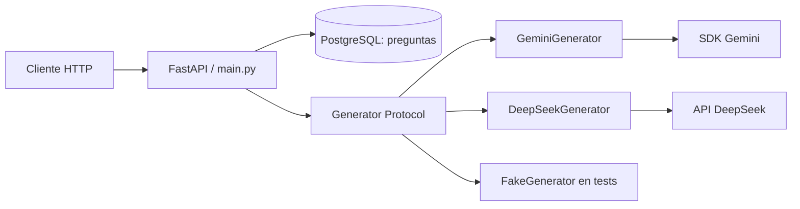

# Arquitectura actual

Mapa de responsabilidades y límites del árbol local; no una lista de tecnologías
futuras. El [estado](CURRENT_STATE.md) distingue implementación local de entrega.

## Flujo HTTP y generación

- [main.py](../src/evidenceops/main.py) define rutas, composición, dependencias
  y traducción de errores a HTTP. [schemas.py](../src/evidenceops/schemas.py)
  define contratos HTTP; OpenAPI de la API es la referencia interactiva.
- [models.py](../src/evidenceops/models.py) y
  [database.py](../src/evidenceops/database.py) separan persistencia de schemas:
  una Session por operación de datos, commit explícito y rollback ante errores.
  Migraciones en [migrations](../migrations). Motivos: [D008](decisions/D008-persistence.md).
- Al generar, se recupera el texto y se cierra la Session antes de esperar al
  proveedor. No se retiene conexión/transacción durante la inferencia. La salida
  es efímera y `external_sources_consulted` lo establece EvidenceOps.
  Motivos: [D010](decisions/D010-ephemeral-generation.md).
- [generation.py](../src/evidenceops/generation.py) es la frontera independiente
  de HTTP, DB y SDK: Protocol, contenido validado y error con causa propia.
  [generator_factory.py](../src/evidenceops/generator_factory.py) elige el adapter
  mediante configuración. [gemini.py](../src/evidenceops/gemini.py) y
  [deepseek.py](../src/evidenceops/deepseek.py) aplican instrucciones compartidas,
  validan la salida y clasifican fallos propios. [D012](decisions/D012-generator-boundary.md).

## Configuración y recursos

[config.py](../src/evidenceops/config.py) valida configuración del entorno y
`.env`. `GenerationSettings` no exige DB; `Settings` añade su URL para la API.
Las variables de entorno prevalecen sobre `.env`; defaults y nombres en
[.env.example](../.env.example), dependencias en [pyproject.toml](../pyproject.toml)
y versiones resueltas en [uv.lock](../uv.lock).

`EVIDENCEOPS_LLM_PROVIDER` selecciona `gemini` (por defecto) o `deepseek`; cada
uno usa su clave, modelo, límite de salida y timeout. La configuración Gemini
existente conserva sus nombres y valores por defecto.

El lifespan comprueba PostgreSQL al arrancar y crea/reutiliza un generador si
no se inyecta uno. Falta de clave impide ese arranque, pero no se hace inferencia
ni se verifica la clave contra el proveedor. La aplicación cierra solo recursos
propios y libera el Engine incluso si falla el cierre del generador.
[Startup](decisions/D009-startup.md) y [ownership](decisions/D012-generator-boundary.md).

## Subsistemas independientes

La adquisición PubMed se mantiene fuera de FastAPI, DB y generación:
[pubmed.py](../src/evidenceops/pubmed.py) hace ESearch/EFetch y clasifica errores
externos; [pubmed_parser.py](../src/evidenceops/pubmed_parser.py) interpreta XML
y separa registros inválidos; [biomedical.py](../src/evidenceops/biomedical.py)
define el contrato interno sin tipos de PubMed. `PubMedSettings` tiene entorno
independiente. [publications.py](../src/evidenceops/publications.py) hace el
upsert atómico en PostgreSQL dentro de la transacción del llamador; el modelo y
la migración protegen `(source, source_id)` y conservan un UUID interno. El
cliente PubMed no persiste ni alimenta la generación.
[ingestion_cli.py](../src/evidenceops/ingestion_cli.py) implementa `evidenceops ingest`
y posee/cierra cliente y Engine; [ingestion.py](../src/evidenceops/ingestion.py)
coordina búsqueda opcional, deduplicación, lotes y fallos parciales sin poseer
los recursos inyectados. Cada documento tiene su transacción y solo cuenta éxito
tras el commit. El UUID candidato frente al devuelto distingue crear/actualizar
sin leer antes de escribir. Flujo:

`CLI → ESearch opcional → PMIDs únicos → EFetch por lote → parser → BiomedicalDocument → upsert → commit → resumen`

No se retiene conexión DB durante adquisición. No hay endpoint de ingestión;
los documentos persistidos no se conectan aún con generación. Motivos y alcance en
[D021](decisions/D021-biomedical-ingestion-source-and-contract.md) y
[D022](decisions/D022-biomedical-publication-persistence.md) y
[D023](decisions/D023-biomedical-ingestion-pipeline.md).

La representación de publicaciones en [chunking.py](../src/evidenceops/chunking.py)
es una transformación pura: `build_retrievable_unit(document, publication_id=...)`
recibe `BiomedicalDocument` y el UUID de origen; devuelve una `RetrievableUnit`
inmutable o `None` si no hay contenido. Una fila persistida puede convertirse con
`as_biomedical_document` sin añadir acceso a DB a la transformación. Conserva
título, abstract y procedencia. Une solo campos con contenido: título y abstract
con `"\n\n"` entre ambos, solo título o solo abstract si falta el otro; si ninguno
tiene contenido devuelve `None`. No normaliza Unicode, divide,
trunca ni impone tamaño mínimo. La identidad depende de `(source, source_id)`,
estrategia versionada e índice cero; el fingerprint depende del texto efectivo.
El UUID interno sirve de vínculo con la fila y no participa en esos hashes.
No se integra aún en ingestión, API, embeddings o generación.
[Decisión y detalles de reproducibilidad](decisions/D024-retrieval-baseline-and-embeddings.md).

La [evaluación](../evaluation/README.md) usa Generator sin FastAPI ni PostgreSQL:
dataset → run → revisión humana → comparación. Dataset, outputs y juicios son
artefactos diferentes. Estructura válida no implica contenido correcto.

La [observabilidad](subsystems/observability.md) registra eventos comunes de
generación, expone métricas Prometheus en `/metrics` y traza con OpenTelemetry
HTTP → generación → adapter del proveedor; los adapters aportan el usage real
sin cambiar contratos de negocio.
Sus límites y diagnóstico se conservan en el [subsistema](subsystems/observability.md)
y el [plan M5 completado](plans/completed/m5-observability.md).

No hay capa Repository, framework de agentes ni orquestación anticipada.
Consulta el [índice ADR](decisions/README.md) antes de cambiar estos límites.
