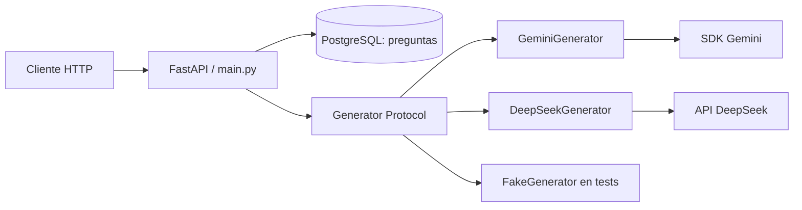

# Arquitectura actual

Mapa de responsabilidades y límites del árbol local; no una lista de tecnologías
futuras. El [estado](CURRENT_STATE.md) distingue implementación local de entrega.

## Flujo HTTP y generación

- [main.py](../src/evidenceops/main.py) define rutas, composición, dependencias
  y traducción de errores a HTTP. [schemas.py](../src/evidenceops/schemas.py)
  define contratos HTTP; OpenAPI de la API es la referencia interactiva.
- [models.py](../src/evidenceops/models.py) y
  [database.py](../src/evidenceops/database.py) separan persistencia de schemas:
  una Session por operación de datos, commit explícito y rollback ante errores.
  Migraciones en [migrations](../migrations). Motivos: [D008](decisions/D008-persistence.md).
- Al generar, se recupera el texto y se cierra la Session antes de esperar al
  proveedor. No se retiene conexión/transacción durante la inferencia. La salida
  es efímera y `external_sources_consulted` lo establece EvidenceOps.
  Motivos: [D010](decisions/D010-ephemeral-generation.md).
- [generation.py](../src/evidenceops/generation.py) es la frontera independiente
  de HTTP, DB y SDK: Protocol, contenido validado y error con causa propia.
  [generator_factory.py](../src/evidenceops/generator_factory.py) elige el adapter
  mediante configuración. [gemini.py](../src/evidenceops/gemini.py) y
  [deepseek.py](../src/evidenceops/deepseek.py) aplican instrucciones compartidas,
  validan la salida y clasifican fallos propios. [D012](decisions/D012-generator-boundary.md).

## Configuración y recursos

[config.py](../src/evidenceops/config.py) valida configuración del entorno y
`.env`. `GenerationSettings` no exige DB; `Settings` añade su URL para la API.
Las variables de entorno prevalecen sobre `.env`; defaults y nombres en
[.env.example](../.env.example), dependencias en [pyproject.toml](../pyproject.toml)
y versiones resueltas en [uv.lock](../uv.lock).

`EVIDENCEOPS_LLM_PROVIDER` selecciona `gemini` (por defecto) o `deepseek`; cada
uno usa su clave, modelo, límite de salida y timeout. La configuración Gemini
existente conserva sus nombres y valores por defecto.

El lifespan comprueba PostgreSQL al arrancar y crea/reutiliza un generador si
no se inyecta uno. Falta de clave impide ese arranque, pero no se hace inferencia
ni se verifica la clave contra el proveedor. La aplicación cierra solo recursos
propios y libera el Engine incluso si falla el cierre del generador.
[Startup](decisions/D009-startup.md) y [ownership](decisions/D012-generator-boundary.md).

## Subsistemas independientes

La [evaluación](../evaluation/README.md) usa Generator sin FastAPI ni PostgreSQL:
dataset → run → revisión humana → comparación. Dataset, outputs y juicios son
artefactos diferentes. Estructura válida no implica contenido correcto.

La [observabilidad](subsystems/observability.md) registra eventos comunes de
generación y metadata segura de proveedor/modelo, sin cambiar contratos de negocio.
Sus límites y diagnóstico se conservan en el [plan M5](plans/active/m5-observability.md).

No hay capa Repository, framework de agentes ni orquestación anticipada.
Consulta el [índice ADR](decisions/README.md) antes de cambiar estos límites.
